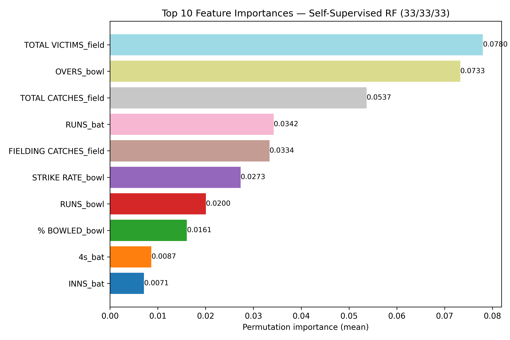
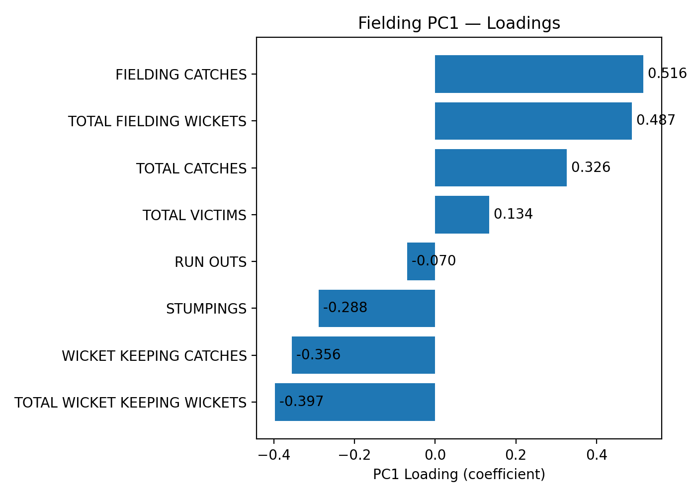

# Junior Cricket Talent Identification with PCA and Random Forests

This is the code from my MSc Data Science project at Durham University, which I ran alongside the Durham County Cricket Academy Pathway. The question was simple enough: if you had to pick the top 30 Under-13 cricketers in the county from a season of match data, how would you do it without just sorting by runs or wickets?

Junior selection often leans on raw totals and whoever catches a coach's eye, and batting usually gets the most attention. I wanted to build something that looked at batting, bowling and fielding together, gave each of them an equal say, and was transparent enough that a coach could see why a player ended up where they did. It was never meant to replace a coach's judgement, more to give them an evidence-based second opinion and help surface players who might otherwise be missed.

## A note on the data

The data comes from the 2025 Durham County Play-Cricket season (U13 league and cup fixtures) and covers 427 players across batting, bowling and fielding exports. Because it is about children, **every player name and club has been replaced with an anonymous ID** (e.g. `Player_005`, `Club_14`) before publishing. The stats themselves are unchanged, so the notebooks reproduce the results from my dissertation exactly.

## How it works

1. **Load and merge.** The three Play-Cricket CSVs are suffixed (`_bat`, `_bowl`, `_field`) and outer-merged, so a specialist batter with no bowling record still stays in. `BEST BOWLING` (e.g. `6/24`) is split into wickets and runs, and blanks are filled with zero, since here a blank almost always means "didn't do it".
2. **Latent skill scores with PCA.** Each discipline is standardised and reduced to its first principal component. PCA signs are arbitrary, so I correlate PC1 with "anchor" stats (runs, wickets and catches as positives, ducks and economy rate as negatives) and flip it where needed, so that higher always means better. Each score is then min-max scaled to [0, 1].
3. **An equal-weighted all-rounder target.** The three scores are averaged 33/33/33.
4. **Random Forest.** A Random Forest regressor is trained on the raw features (with near-duplicate columns above 0.95 correlation removed), tuned with a 50-iteration randomised search and 5-fold cross-validation to minimise MAE, and checked on a 25% hold-out set.
5. **Interpretation.** Permutation feature importance shows which stats drive the rankings, and top-30 leaderboards are produced for all-rounders, batters, bowlers and fielders.

## Results

| Metric (25% hold-out) | Value |
| --- | --- |
| R² | 0.980 |
| MAE | 0.0177 |

Best hyperparameters: 600 trees, max depth 12, `max_features=0.5`, `max_samples=0.85`, `min_samples_split=2`, `min_samples_leaf=1`.

The finding I found most interesting was the feature importance. Once batting, bowling and fielding were weighted equally, fielding and bowling stats (total fielding victims, overs bowled, total catches) mattered more to the overall ranking than runs scored, which pushes back against the usual batting-first way of looking at junior players.





The PC1 loadings show what each latent score is really measuring. Batting PC1 behaves like a "scoring productivity" axis (runs, boundaries, share of team runs), bowling PC1 separates economical wicket-takers from bowlers who concede more, and fielding PC1 is driven by outfield catches.

## Limitations, and what I'd do next

I think being honest about these matters more than the headline numbers.

- **The target is built from the same features the model learns from**, so the very high R² mostly shows the Random Forest can recover a score I constructed, rather than proving it predicts future performance. The feature importances and leaderboards are the more useful outputs. The real test would be validating the rankings against actual county selections or the following season's performance.
- **Scorecards have no match context.** Fifty against a strong attack on a seaming pitch counts the same as fifty against a weak attack on a flat one. Opposition strength, match situation and ball-by-ball or tracking data would make this far more meaningful.
- **Fielding PC1 mixes outfielders and wicketkeepers.** The loadings split the two, so keepers tend to score lower on fielding. Separating keeping and outfield work would be fairer.
- **Some Play-Cricket columns are stored as text** (e.g. `GAMES WON(%)` as `12(63.16%)`), so they currently become zero and carry no signal.
- **The Play-Cricket `Rank` column is included in the PCA step.** That rank is ordered by runs, wickets or victims, so it slightly double counts them. It is correctly excluded from the Random Forest features.
- **Zero imputation treats "not observed" the same as "no performance"**, which could disadvantage players who missed games through injury or selection.
- **One season only.** Youth performance swings a lot with growth and opportunity, so multiple seasons would give a much more stable picture.

## Repo structure

```
data/         Anonymised Play-Cricket exports (batting, bowling, fielding)
notebooks/    01_talent_id_pipeline.ipynb  main pipeline
              02_pc1_loadings.ipynb        PC1 loadings and charts
figures/      Saved charts
outputs/      Top-30 leaderboards and PC1 loading tables
```

## Running it

```bash
pip install -r requirements.txt
cd notebooks
jupyter notebook
```

Run `01_talent_id_pipeline.ipynb` for the model and leaderboards, and `02_pc1_loadings.ipynb` for the loadings charts. The hyperparameter search takes a while on a single core.

## About me

I'm Ollie Hanks, a Data Science MSc graduate (Durham) with a BSc in Sport and Exercise Science (Derby) and twelve years of competitive rowing behind me. I'm interested in sports analytics, especially building metrics that coaches and athletes can actually use. You can find me on [LinkedIn](https://www.linkedin.com/in/ollie-hanks-771756256).
